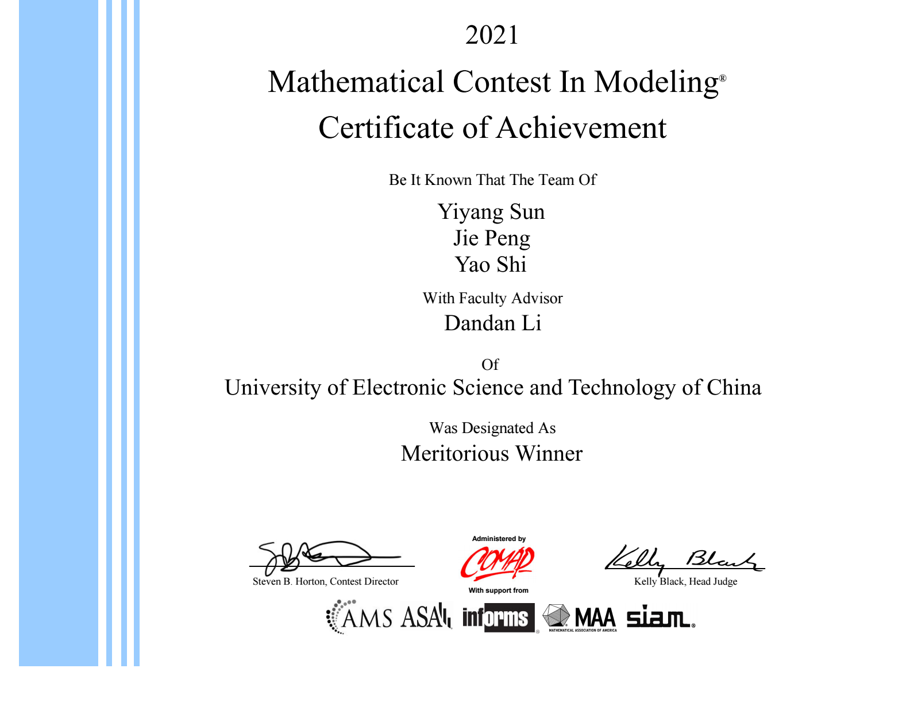

# 2021 MCM Meritorious Article for Problem A :writing_hand:

---

## Problem

2021 Problem A.

## Output

The final article PDF is named with out `team control number`.

[Click here](./2125028.pdf) to check the article.

## $\LaTeX$ File Structure

I split the article into different sections. For each section, there is a independent folder including `index.tex` file and other subsection files.

In this way, it is quite easy to locate where the error occurs. The source `.tex` file is comfortable to read as well.

## Article Skills

### Figures

- Remember to adjust the font size and font weight of the generated figure.
- **Do not leave large empty areas** when there is not enough room for inserting a figure. Adjust the `width` and `height` of relative figures.

### High Level Typesetting

- It is difficult to master typesetting with $\TeX$ in a short period of time, but it is easy with **`Microsoft Word`**. **Use it for typesetting. Export the final PDF and finally insert it into the `.tex` file.**

### References

- Here is **the easiest way of adding references** to your article (in my opinion).
- Use `thebibliography`, `bibitem` and `cite` commands.
- For detail, please refer to [Reference/index.tex](./reference/index.tex).

## About

### License

MIT

### Teammates

[@Shiro](https://github.com/AtomicReactor-lab) and [@LucasTrace](https://github.com/LucasTrace).
